# Laugh Engine

A Vulkan implementation of real-time PBR renderer.

---

### Results

* Video demo available on [my homepage](http://jian-ru.github.io/)

| Paper Mill | Factory |
| --- | --- |
|  | 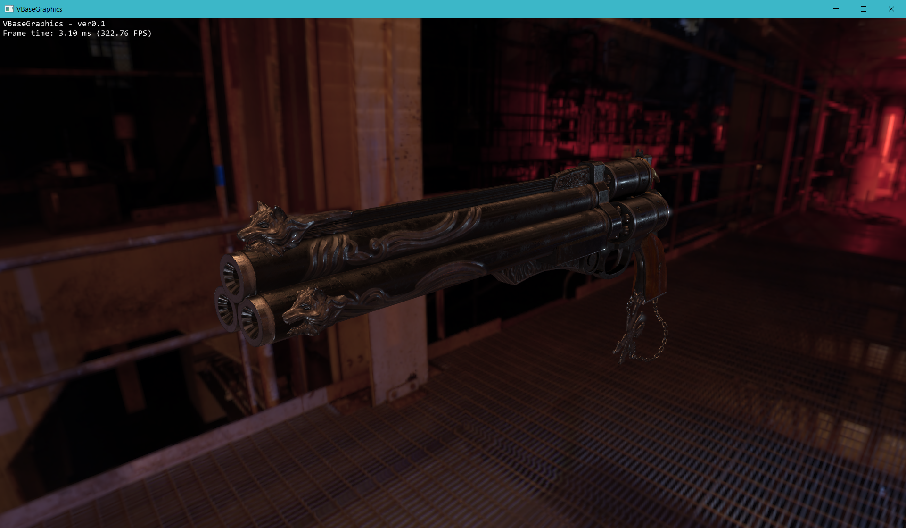 |

| Mon Valley | Canyon |
| --- | --- |
|  | 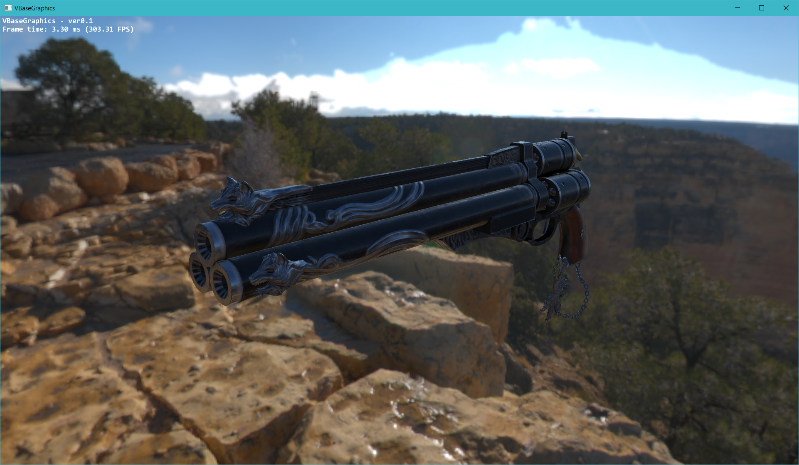 |

### glTF Support

* glTF, also called the GL Transmission Format, it is a runtime asset dilivery format for GL-based applications. It supports common functionalities of 3D applications such as geometry, texture, skin, and animation. It also allows extension, for example, I used the FRAUNHOFER_materials_pbr extension to load PBR textures.
* It aims to form a standard/common format for runtime asset dilivery/exchange. In my opinion, it has better documentation than FBX and possess some abilities that some other file formats don't (e.g. scene hierarchy, skin, animation). I believe, if it gets popular, it will be a great convenience to both application developers and artists because less effort will be required to perform application-specific conversion on file formats.
* In order to show my support, I added glTF support to Laugh Egine. It is now able to load geometry and material data from glTF files.
* Below are some screen shots of 3D models loaded from glTF files. Thanks to Sketchfab for providing these glTF assets and Gary Hsu for the glTF 2.0 test models.

| Microphone (glTF 1.0) | Helmet (glTF 1.0) |
| --- | --- |
|  |  |

| Boom Box (glTF 2.0) | Lantern (glTF 2.0) |
| --- | --- |
|  |  |

### Optimizations

* Spherical Harmonics Diffuse Lighting
  * The lastest update to Laugh Engine implemented spherical harmonics diffuse lighting. It doesn't change too much in terms of speed but it does save a lot of memory and opens up an opportunity for algorithms that bake environment lighting at lots of locations in a scene (e.g. LPV - Light Propogation Volume), which I want to implement in the future.
  * For each environment map, only 9 float3 SH coefficients are needed which take up **9 * 12 = 108 bytes** in contrast to the **32 * 32 * 6 * 16 = 98,304 bytes** storage for a 32x32 cube map which was used to store diffuse irradiance previously. Consequently, a **99.9%** saving in space was achieved in my case. In practice, since diffuse irradiance is a low frequency signal, we probably don't need a 32x32 cube map. But even for a 4x4 cube map, using spherical harmonics still result in **93.0%** saving in space. Such a huge saving thus justified a little extra computation cost required by SH.
  * The following 6 screenshots show the diffuse irradiance recovered using precomputed SH coefficients. It is easy to see that SH successfully captures the tone of the environment (e.g. the bottom of the helmet reflects the yellow tone of desert, the top of the helmet captures the blue sky).
  
  | 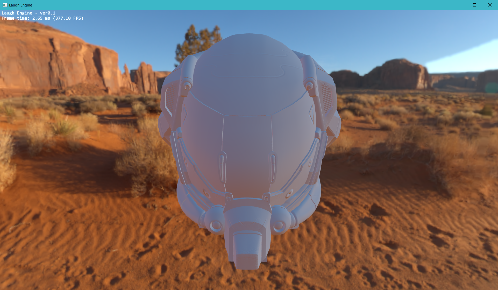 | 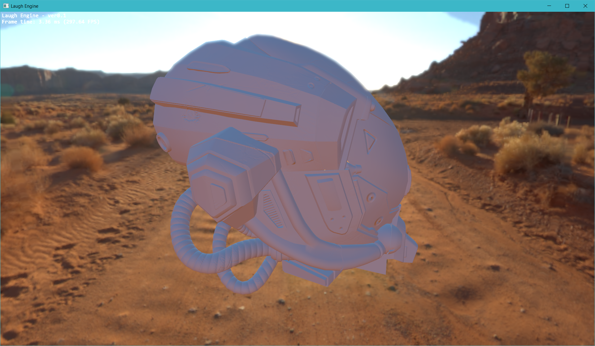 |
  | --- | --- |
  | 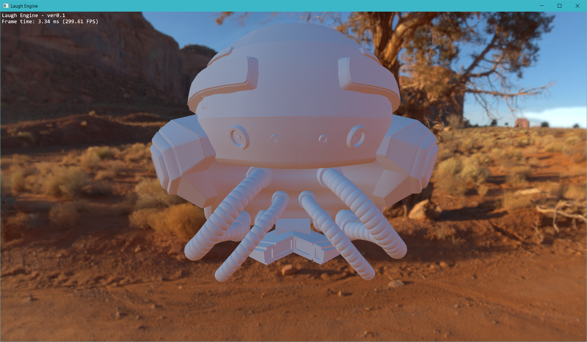 |  |
  | 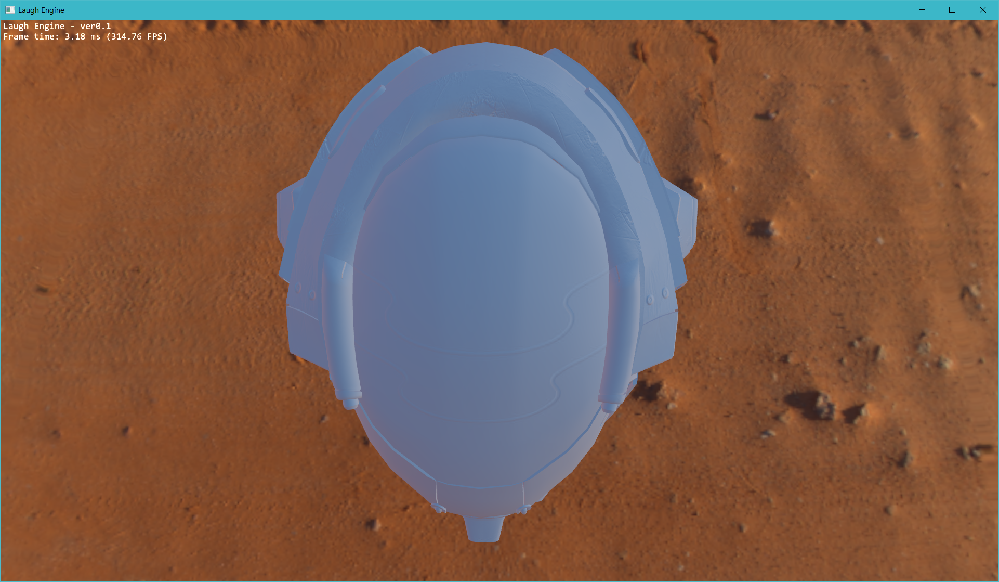 | 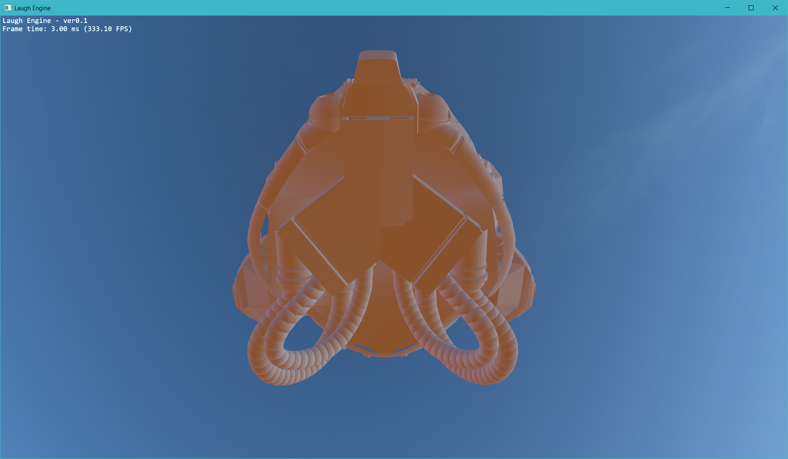 |
  
* Optimized Bloom
  * Two optimizations were made to my bloom implementation:
    * Performing Gaussian kernel filtering at half resolution
    * Taking advantage of hardware linear filtering to halve the number of texture read operations during the blur pass
  * The first optimization is easy to understand. For the second one, the basic idea is that we can take advantage of hardware linear filtering feature to fetch two texels in one texture read operation, which is usually much cheaper than doing two texture reads. To do that we need to compute modified weights and texture coordinate offsets that are specific to the size/mean and sigma/stddev of the Gaussian kernel used. For more information, you can refer to this article [An investigation of fast real-time GPU-based image blur algorithms](https://software.intel.com/en-us/blogs/2014/07/15/an-investigation-of-fast-real-time-gpu-based-image-blur-algorithms).
  * Following chart shows the performance difference in milliseconds per frame for different models. Benchmark was performed on a GTX 1080 graphics card.
  
  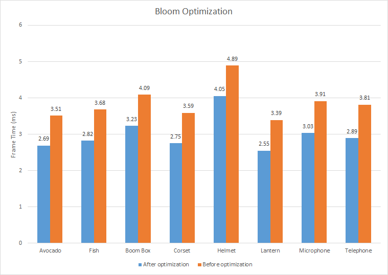
  
* MSAA
  * I implemented MSAA in my custom resolve shader. The basic idea is that for each type of materials, select a representative sample (if there is any), perform lighting calculation using corresponding material model only for the representatives, and finally, colors of all material types are blended together based on the percentage of samples having that type.
  * Following chart shows the performance difference between MSAA and SSAA in terms of milliseconds per frame. Performance boost is more salient on models that cover a large portion of the viewport. Test was performed on a GTX 1080 graphics card.
  
  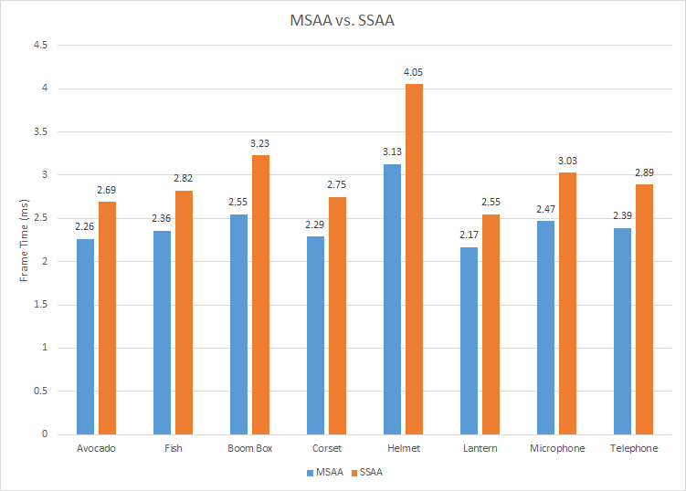
  

### Overview

|  | 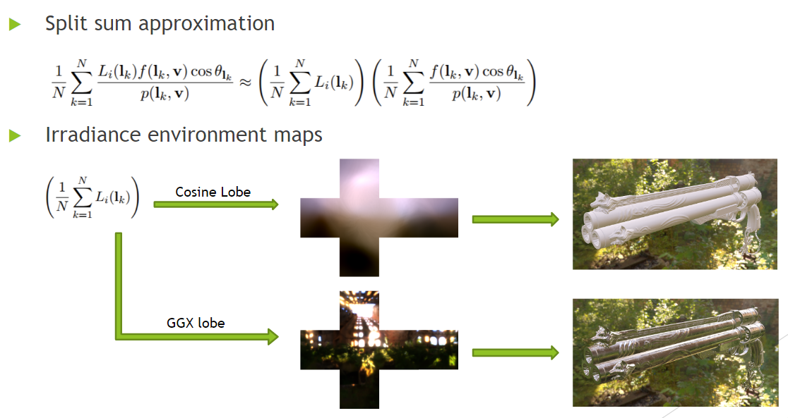 |
| --- | --- |
|  | 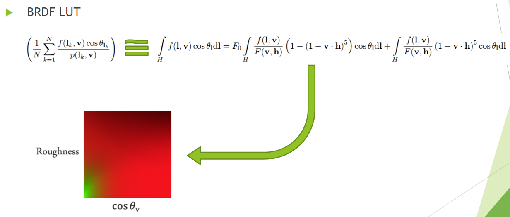 |
|  |

### Performance Analysis

* Precomputation performance
  * It is not real-time but fast enough to be used for interactive editting
  * The increase of execution time from 128x128 to 256x256 is very small. Probably the GPU is not saturated at that time.
  
  | Envrionment Prefiltering | BRDF LUT Baking |
  | --- | --- |
  |  |  |

* PBR vs. Blinn-Phong
  * PBR using IBL only
  * Blinn-Phong was tested using two point light sources
  * Framebuffer resolution was 1920x1080 with no AA
  * Bloom was on
  * The scene with a Cerberus pistol in it was used for benchmark
  * Basically no addtional cost by using PBR over Blinn-Phong but we get much better quality
  
  

### Build Instruction

* Install LunarG Vulkan SDK
* If you have Visual Studio 2015, the solution should build out of the box
* To run the program, you will need to copy the .dlls to executable path or system paths
* Builds on other platforms are not supported yet

---

### Third-Party Credits

#### References:
* [Vulkan Tutorial by Alexander Overvoorde](https://vulkan-tutorial.com)
* [Vulkan Samples by Sascha Willems](https://github.com/SaschaWillems/Vulkan)
* [PBR Course Note](http://blog.selfshadow.com/publications/s2013-shading-course/karis/s2013_pbs_epic_notes_v2.pdf)
* [IBLBaker](https://github.com/derkreature/IBLBaker)

#### Libraries
* [GLFW](http://www.glfw.org/)
* [GLM](http://glm.g-truc.net/0.9.8/index.html)
* [GLI](http://gli.g-truc.net/0.8.2/index.html)
* [Assimp](http://www.assimp.org/)
* [Tinygltf](https://github.com/syoyo/tinygltfloader)

#### Assets
* [glTF 2.0 Test Models](https://github.com/sbtron/BabylonJS-glTFLoader/tree/master/models/2.0)
* [Battle Damaged Sci-fi Helmet - PBR by theblueturtle_](https://sketchfab.com/theblueturtle_)
* [Mysterious Island Centurion by levikingvolant](https://sketchfab.com/levikingvolant)
* [Microphone GXL 066 Bafhcteks by Gistold](https://sketchfab.com/gistold)
* [Cerberus by Andrew Maximov](http://artisaverb.info/Cerberus.html)
